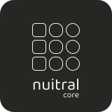

  <picture>
    <source media="(prefers-color-scheme: dark)" srcset="./media/logo-core-dark-mode.svg" width="150" height="150" />
    <source media="(prefers-color-scheme: light)" srcset="./media/logo-core-light-mode.svg" width="150" height="150" />
    
  </picture>

<b>nuitral-core</b> is the foundational library of the <b>nuitral</b> suite and represents the core layer shared across all other libraries that expose UI components. 

<b>Status:</b> This project is currently in <b>alpha version</b>.

---

### Progress status

| Status | Module / Component    | Description           |
|-------|-----------------------|-----------------------|
| ✅ | `nuitral-core-icon`   | Base Icon componente  |
| ✅ | `nuitral-core-input`  | Base Input component  |
| 🚧 | `nuitral-core-button` | Base Button component |
| 🕒 | `nuitral-core-tabs`   | Tab List component    |
| 🕒 | `nuitral-core-tab`    | Base Tab component    |
| 🕒 | `nuitral-core-card`   | Base Card component   |
| 🕒 | `nuitral-core-box`    | Base Box component    |

Legend:
- ✅ = completed
- 🚧 = in progress
- 🕒 = planned

---

### 🔗 Suite

This library is part of the **nuitral** suite, a native UI toolkit designed to build modern, flexible, and high-performance interfaces.

Explore the suite → https://nuitral.github.io

---

### License

This project is licensed under the [MIT License](https://github.com/nuitral/core/blob/main/LICENSE).

Copyright (c) 2025 **Nicola Centonze**

